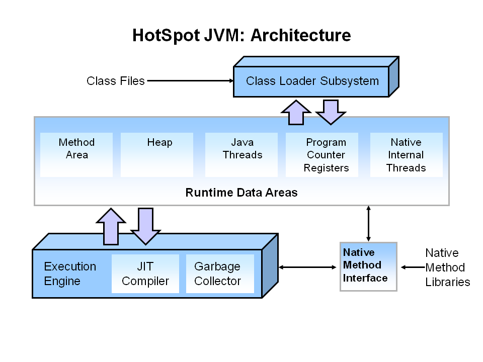

# Jvm深度探索

### JVM 体系结构

JVM有三个重要的组件：Heap、GC、JIT。其中Heap是存储对象数据的位置，Heap区域由启动时选择的垃圾收集器管理，JVM的大多数调优场景就是选择最合适的垃圾收集器和调整堆大小。

### 类加载 ClassLoader

## GC
自动垃圾收集是查看堆内存，识别正在使用哪些对象以及哪些对象未被删除以及删除未使用对象的过程。使用中的对象或引用的对象意味着程序的某些部分仍然维护指向该对象的指针。程序的任何部分都不再引用未使用的对象或未引用的对象。因此可以回收未引用对象使用的内存。
在Java中，解除分配内存的过程由垃圾收集器自动处理。基本过程可以描述如下。

Heap结构可以看出堆结构划分：年轻代，老年代，以及永久代

参考文档：

[https://www.oracle.com/webfolder/technetwork/tutorials/obe/java/gc01/index.html](https://www.oracle.com/webfolder/technetwork/tutorials/obe/java/gc01/index.html)
[https://www.cubrid.org/blog/how-to-tune-java-garbage-collection](https://www.cubrid.org/blog/how-to-tune-java-garbage-collection)