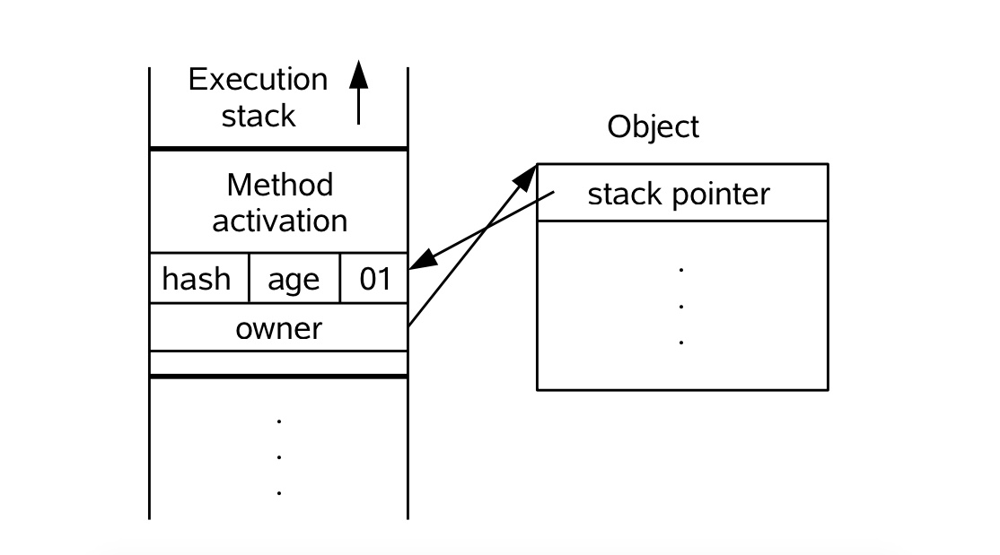

# Java并发编程深度探索-锁优化与分类

### 多线程的应用场景

多线程是为了解决在单一进程等待IO操作时CPU空闲的问题,以及使多道任务同时执行

结论

>如果IO或者CPU已经打满，多线程是毫无意义的；
如果没有IO操作,多线程不比单线程快,因为线程切换时也要占用指令周期；
如果单线程被阻塞了,整个进程就被阻塞,多线程的话还又别的线程可以执行,所以进程不会被阻塞；
如果在做服务器程序时应该用尽量少的线程,而不是不用多线程,在做PC软件时,应该充分利用多线程,以加快用户响应速度。
---

### 锁优化

高效并发是从JDK1.5到1.6的一个重要改进，HotSpot虚拟机开发团队在这个版本上花费了大量精力实现各种锁优化技术

- 适应性自旋(Adaptive Spining)
- 锁消除(Lock Elimination)
- 锁粗化(Lock Coarsening)
- 轻量级锁(LightWeight Locking)
- 偏向锁(Biased Locking)

这些技术都是为了在线程之间更高效地共享数据，以解决竞争问题从而提高程序的执行效率。

1、自旋锁与自适应自旋

互斥同步时，我们提到此过程中对性能最大的影响是线程的阻塞，因为由运行和阻塞间状态的切换都需要在操作系统「内核态」完成，频繁地在「用户态」和「内核态」之间切换会比较消耗性能。
由于多条线程共享同一个数据区域时的锁定状态往往只会持续很短的时间，所以为了这很短的时间去阻塞OR恢复线程就是比较「不合算」的，
如果物理机器上有2个及以上的CPU，那么我们就可以让两个线程并行执行，在线程A独占数据区域时，另一个线程B不挂起(阻塞)而是稍等片刻但是不放弃CPU时间，因为可能很快线程A就会完成对共享数据的操作后释放锁。
让线程B「稍等片刻」的方式就是让线程执行一个忙循环，即所谓的「自旋」，这样的技术就是「自旋锁」。
自旋锁在JDK1.42中就已经引入，默认关闭，可通过-XX:+UseSpining参数开启。
在JDK1.6以后引入了自适应的自旋锁，且默认开启。自适应意味着自旋的时间不再是固定的，而是由上一个在同一个锁上的自旋时间和锁拥有者的状态来决定。

2、锁消除

锁消除是指虚拟机JIT即使编译器在运行时，对一些「代码上要求同步」，但是被检测到不存在共享数据竞争的锁进行消除。
是否进行锁消除的依据来源于逃逸分析中的数据支持，如果一段代码中，堆上的数据都不会逃逸出去从而被别的对象引用，则可以把它当做「虚拟机栈」中的私有数据，即线程私有的，从而不需要进行加锁操作。

3、锁粗化

大多数情况下，我们希望锁的范围尽可能小，一段代码块中尽量只在共享数据实际作用域内才进行同步，这样即使存在锁竞，那等待锁的线程也会较快地拿到锁。
但是有些情况譬如一系列的操作都对同一个对象反复加锁和解锁，甚至加锁解锁的操作是在循环体内不断重复，那么即使没有线程竞争，此操作也会引起较大地性能损耗。
如果虚拟机探测到有这样一段零碎的操作都是在对同一个对象进行加锁，将会将加锁范围拓宽延伸(粗化)到整个操作序列的外部。

4、轻量级锁

轻量级锁是JDK1.6时加入的，相对于操作系统的传统的互斥锁「重量级锁」，轻量级锁用来在多线程条件下，减少重量级锁使用操作系统互斥量产生的性能消耗。

锁的获取

>线程在执行同步块之前,JVM会先在当前线程的栈桢中创建用于存储锁记录的空间,并将对象头中的Mark Word复制到锁记录中,官方称为Displaced Mark Word。
然后线程尝试使用CAS将对象头中的Mark Word替换为指向锁记录的指针。如果成功,当前线程获得锁,如果失败,表示其他线程竞争锁,当前线程便尝试使用自旋来获取锁。
---

轻量级锁的实现，和Java虚拟机的内存布局相关，在HotSpot虚拟机的对象头(Object Header)中，分为两部分数据：

- 1.运行时数据如HashCode、GC分代年龄等
- 2.存储方法区对象类型数据的指针

其中第1.部分的32位(或64位)的数据，官方称为“Mark Word”，它是实现轻量级锁的关键。
如在32bit位的HotSpot虚拟机中，对象未被锁定的正常状态下，
32位的Mark Word中25bit用于存储对象的哈希码(HashCode)，4bit存储对象的分代年龄，2bit存储锁标志位，1bit位固定为0，
而在对象处于其他状态(轻量级锁定、重量级锁定、GC标记、可偏向)时，对象头中的Mark Word部分如下：

在代码进入同步块时，如果此同步对象未被锁定，锁标志位“01”，
虚拟机将在当前线程的栈帧中建立一个名为锁记录Lock Record的空间用于存储锁对象对象头中Mark Word的拷贝，
官方称为Displaced Mark Word。此时线程堆栈和对象头状态如下图：

然后虚拟机将用CAS操作尝试将对象的Mark Word更新为指向Lock Record的指针。
如果更新成功，则表示当前线程成功持有了该对象的锁，Mark Word的锁标志位将变为“00”表示对象处于「轻量级锁定」状态。此时示意图如下：

如果更新操作失败，虚拟机会首先检查对象的Mark Word是否指向当前线程的栈帧：
是：说明当前线程已经持有该对象的锁，可以直接进入同步块继续执行；
否：说明该对象的锁被其他线程抢占。
如果有2条以上的线程正在争用同一个锁，则轻量级锁将不再有效，而是膨胀为「重量级锁」，锁标志位的状态值变为“10”，Mark Word中存储的就是指向重量级锁的指针，后面等待锁的线程也要进入「阻塞」状态。
上述过程描述的是轻量级锁的加锁过程，它的解锁过程也是由CAS操作来进行的，如果对象的Mark Word仍然指向Lock Record，那就用CAS操作把线程对象当前的Mark Word和线程中复制的Lock Record中的Displaced Mark Word替换回来，
如果替换成功，则完成同步过程；
如果失败，说明有其他线程尝试过获取该锁，则需要在释放锁的同时唤醒被挂起的线程。

5、偏向锁

偏向锁也是JDK1.6中引入的一项锁优化，目的是消除数据在无竞争条件下的同步原语，进一步提高程序运行性能。
作为对比，轻量级锁就是在无竞争条件下使用CAS操作去消除同步使用的互斥量，而偏向锁就是在无竞争的情况下消除整个同步，连CAS操作都不需要。
偏向锁的「偏」的意思是它会“偏向于”第一个获取它的线程，如果在接下来的过程中该偏向锁没有被其他线程获取，则此线程永远不需要进行同步。

原理：

假设当前虚拟机启用了偏向锁，那么当锁对象第一次被线程获取的时候，虚拟机将会把对象头中的标志位设为“01”，即偏向模式。
同时使用CAS操作把获取到这个锁的线程ID记录在对象的Mark Word中，如果CAS操作成功，持有偏向锁的线程每次重入时，虚拟机都可以不用作任何同步操作。
「偏向模式」持续到有其他线程尝试获取这个偏向锁时就宣告结束了。
根据锁对象目前是否处于被锁定的状态，撤销偏向后的状态会恢复到轻量级锁定(“00”)或未锁定(“01”)状态。
后续的操作就如同上面介绍的轻量级锁那样继续执行，如下图所示：

小结：

>偏向锁可以提高带有同步但无竞争的程序性能。
它同样是一个带有效益权衡(Trade-Off)性质的优化，也就是说它并不一定总是对程序运行有利，
如果程序运行过程中的大多数锁总是被多个不同线程访问，那偏向模式就是多余的。
在具体问题具体分析的情况下，有时候使用参数-XX:-UseBiasedLocking来禁止偏向锁优化反而可以提升性能。
---

### 锁分类

1、按照其性质分类

公平锁/非公平锁

公平锁是指多个线程按照申请锁的顺序来获取锁。
非公平锁是指多个线程获取锁的顺序并不是按照申请锁的顺序，有可能后申请的线程比先申请的线程优先获取锁。
有可能，会造成优先级反转或者饥饿现象。对于Java ReentrantLock而言，通过构造函数指定该锁是否是公平锁，默认是非公平锁。
非公平锁的优点在于吞吐量比公平锁大。对于Synchronized而言，也是一种非公平锁。
由于其并不像ReentrantLock是通过AQS的来实现线程调度，所以并没有任何办法使其变成公平锁。

乐观锁/悲观锁

乐观锁与悲观锁不是指具体的什么类型的锁，而是指看待并发同步的角度。
悲观锁认为对于同一个数据的并发操作，一定是会发生修改的，哪怕没有修改，也会认为修改。
因此对于同一个数据的并发操作，悲观锁采取加锁的形式。悲观的认为，不加锁的并发操作一定会出问题。
乐观锁则认为对于同一个数据的并发操作，是不会发生修改的。在更新数据的时候，会采用尝试更新，不断重新的方式更新数据。
乐观的认为，不加锁的并发操作是没有事情的。从上面的描述我们可以看出，悲观锁适合写操作非常多的场景，乐观锁适合读操作非常多的场景，不加锁会带来大量的性能提升。
悲观锁在Java中的使用，就是利用各种锁。乐观锁在Java中的使用，是无锁编程，常常采用的是CAS算法，典型的例子就是原子类，通过CAS自旋实现原子操作的更新。

独享锁/共享锁

独享锁是指该锁一次只能被一个线程所持有。共享锁是指该锁可被多个线程所持有。
对于Java ReentrantLock而言，其是独享锁。但是对于Lock的另一个实现类ReentrantReadWriteLock，其读锁是共享锁，其写锁是独享锁。
读锁的共享锁可保证并发读是非常高效的，读写，写读 ，写写的过程是互斥的。独享锁与共享锁也是通过AQS来实现的，通过实现不同的方法，来实现独享或者共享。
对于Synchronized而言，当然是独享锁。

互斥锁/读写锁

上面讲的独享锁/共享锁就是一种广义的说法，互斥锁/读写锁就是具体的实现。
互斥锁在Java中的具体实现就是ReentrantLock，读写锁在Java中的具体实现就是ReentrantReadWriteLock

可重入锁

可重入锁又名递归锁，是指在同一个线程在外层方法获取锁的时候，在进入内层方法会自动获取锁。说的有点抽象，下面会有一个代码的示例。
对于Java ReentrantLock而言, 他的名字就可以看出是一个可重入锁，其名字是Reentrant Lock重新进入锁。
对于Synchronized而言,也是一个可重入锁。可重入锁的一个好处是可一定程度避免死锁。
如果锁是不具有可重入性特点的话，那么线程在调用同步方法、含有锁的方法时就会产生死锁。

2、按照设计方案来分类

自旋锁/自适应自旋锁

在Java中，自旋锁是指尝试获取锁的线程不会立即阻塞，而是采用循环的方式去尝试获取锁，这样的好处是减少线程上下文切换的消耗，缺点是循环会消耗CPU。

锁粗化/锁消除

锁消除是指虚拟机即时编译器在运行时，对一些代码上要求同步，但是被检测到不可能存在共享数据竞争的锁进行消除。
锁消除的主要判定依据来源于逃逸分析的数据支持，
如果判断在一段代码中，堆上的所有数据都不会逃逸出去从而被其他线程访问到，那就可以把它们当做栈上数据对待，认为它们是线程私有的，同步加锁自然就无须进行。
如果一系列的连续操作都对同一个对象反复加锁和解锁，甚至加锁操作是出现在循环体中的，那即使没有线程竞争，频繁地进行互斥同步操作也会导致不必要的性能损耗。
如果虚拟机探测到有这样一串零碎的操作都对同一个对象加锁，将会把加锁同步的范围扩展（粗化）到整个操作序列的外部

偏向锁/轻量级锁/重量级锁

这三种锁是指锁的状态，并且是针对Synchronized。在Java 5通过引入锁升级的机制来实现高效Synchronized。
这三种锁的状态是通过对象监视器在对象头中的字段来表明的。

偏向锁是指一段同步代码一直被一个线程所访问，那么该线程会自动获取锁。降低获取锁的代价。

轻量级锁是指当锁是偏向锁的时候，被另一个线程所访问，偏向锁就会升级为轻量级锁，其他线程会通过自旋的形式尝试获取锁，不会阻塞，提高性能。

重量级锁是指当锁为轻量级锁的时候，另一个线程虽然是自旋，但自旋不会一直持续下去，当自旋一定次数的时候，还没有获取到锁，就会进入阻塞，该锁膨胀为重量级锁。
重量级锁会让其他申请的线程进入阻塞，性能降低。

分段锁

分段锁其实是一种锁的设计，并不是具体的一种锁，对于ConcurrentHashMap而言，其并发的实现就是通过分段锁的形式来实现高效的并发操作。
我们以ConcurrentHashMap来说一下分段锁的含义以及设计思想，
ConcurrentHashMap中的分段锁称为Segment，它即类似于HashMap（JDK7与JDK8中HashMap的实现）的结构，
即内部拥有一个Entry数组，数组中的每个元素又是一个链表；同时又是一个ReentrantLock（Segment继承了ReentrantLock)。

当需要put元素的时候，并不是对整个hashmap进行加锁，而是先通过hashcode来知道他要放在那一个分段中，然后对这个分段进行加锁，所以当多线程put的时候，
只要不是放在一个分段中，就实现了真正的并行的插入。

但是，在统计size的时候，可就是获取hashmap全局信息的时候，就需要获取所有的分段锁才能统计。
分段锁的设计目的是细化锁的粒度，当操作不需要更新整个数组的时候，就仅仅针对数组中的一项进行加锁操作。
