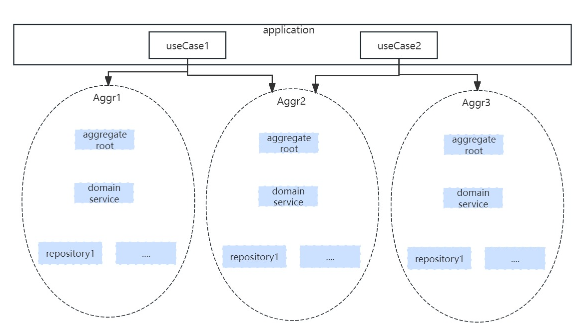
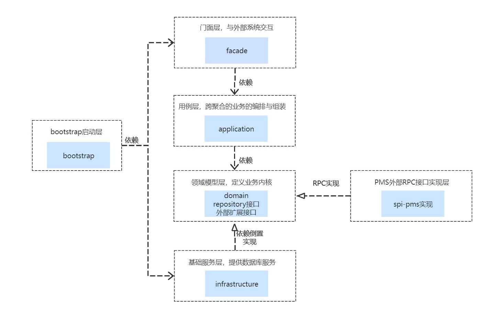

# DDD领域驱动设计

领域驱动设计是一种强调业务领域知识融入到软件设计中的方法，适用于解决复杂业务问题的软件系统

```
领域驱动设计（Domain-Driven Design，DDD）是一种软件架构设计方法，主要关注于解决复杂业务问题的软件系统
DDD强调将业务领域知识融入到软件设计中，以便更好地理解和解决问题。
这种方法通常用于大型软件系统的开发，特别是那些涉及多个团队和跨平台的系统。
在DDD中，核心思想是将核心业务模型（领域模型）置于系统的中心，通过建立丰富的领域模型和充分的业务上下文边界，来驱动系统的设计和开发
```

领域驱动设计的基本思想:
- 1.将项目的主要重点放在核心领域（core domain）和域逻辑上，而不是过于关注技术细节
- 2.将复杂的设计放在有界上下文（bounded context）的模型上，以便更好地划分业务边界
- 3.与领域专家合作，通过迭代完善的概念模式来解决特定领域的问题
- 4.领域模型是对业务模型的抽象，DDD将业务模型翻译成系统架构设计的一种方式

在DDD中，模型（Model）是业务的核心，承载着业务的属性和具体的行为。模型分为Entity、Value Object和Service三种类型：

- 具有特定的标识，在系统中全局唯一，内部值可以是变化的
- 内部值是不变的，不存在生命周期
- 当属性或行为不适合放在Entity或Value Object中时，使用Service来处理

```
DDD还强调业务操作的高内聚和低耦合，将业务行为Action收口在模型中，避免重复代码。
此外，DDD设计的特点还包括根据业务模型设计系统、数据模型统一、业务模型与数据源无关等
```


下面结合实际应用介绍一下领域驱动设计的使用。

我理解的DDD领域驱动设计其实包括两部分的设计：

- 第一部分是战略层面领域的划分设计，这部分设计很重要，直接划分公司的业务域(核心域、通用域、支撑域等)
- 第二部分是战术层面内部细节的设计，主要是聚合的划分与聚合内部的结构设计。

因此归纳一下，DDD领域划分大概可以分三步，自顶向下逐步细分：

```
1、领域的划分(战略层面);
2、界限上下文的划分，这里界限上下文可以理解为一个系统或者一个独立部署的应用，一个界限上下文有可能横跨多个领域(战略层面)；
3、界限上下文内部聚合的划分（一致性边界的划分，确定一致性边界内真正的不变条件），这里就是我们单个应用里面比较细的聚合的划分了。(战术层面)
比较官方的划分描述是【在一致性边界里面确定真正的不变条件】，这个描述我理解的也不是特别透，
大概有几个原则：
  a、聚合足够小；
  b、一次事务的修改只涉及一个聚合；
  c、不能破坏操作的一致性。
```

战略层面的设计这里不做讨论，我们看一下战术层面也就是单个独立部署的应用内部的结构：

- 1、聚合视图

  

  ```
  一般情况下，一个聚合里面有一个聚合根、一个domainService、多个repository。
  应用层的应用服务编排与组合不同的聚合达到业务目标。
  当然DDD也有不适合的场景：简单的增删改查，这种情况直接在应用层访问repository操作数据就可以了，不用定义领域模型。
  ```

- 2、代码视图

  
