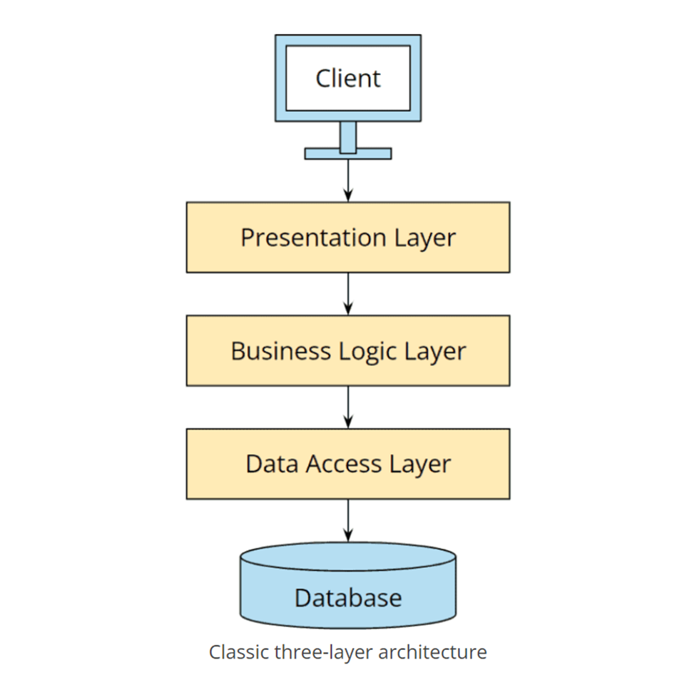
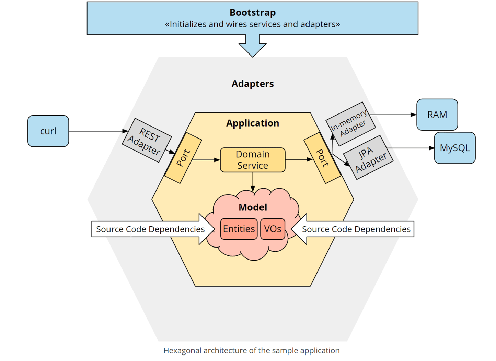

# Hexagonal

```
优秀的软件架构允许在其生命周期内以尽可能少的、持续的努力来进行更改
（并且相应地为客户提供可预测的成本）
```

是否存在这么一种软件架构呢？我们先看一下传统的分层结构


分层结构的业务逻辑直接依赖于数据库，而根据递性依赖表示层也间接依赖与数据库层，
这不仅影响数据库，还影响应用程序访问的任何类型的基础设施层，程序边界模糊。

我们看一下完整的六边形结构：

