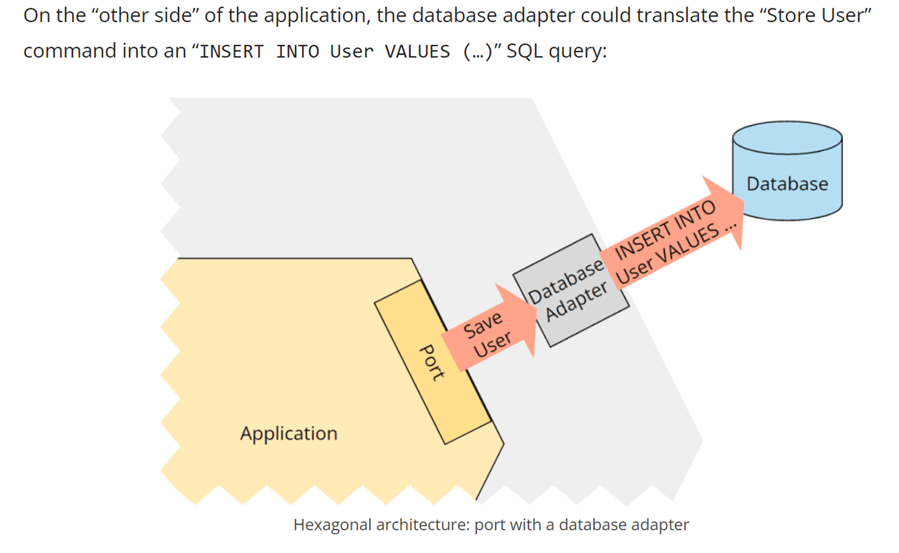
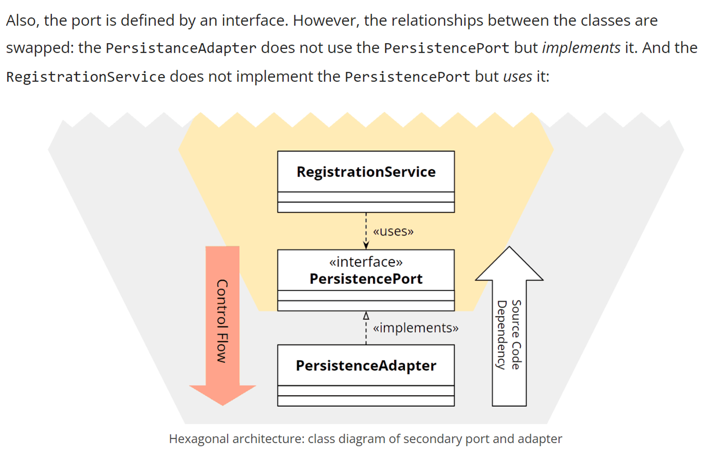
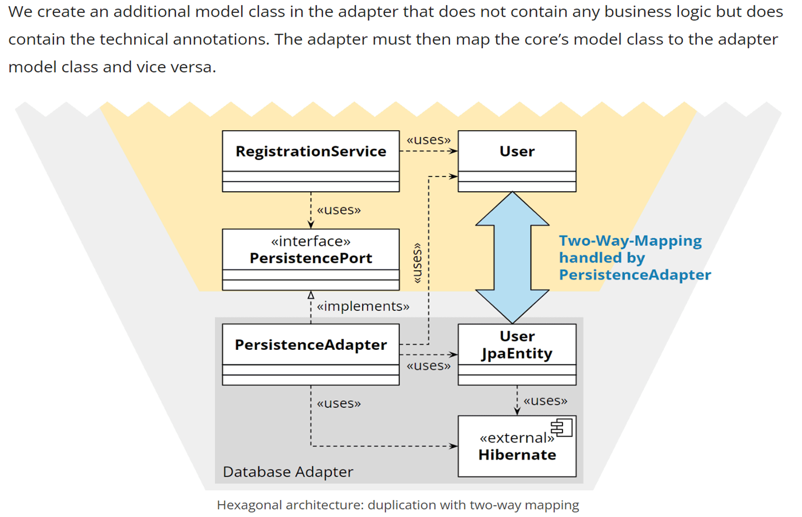
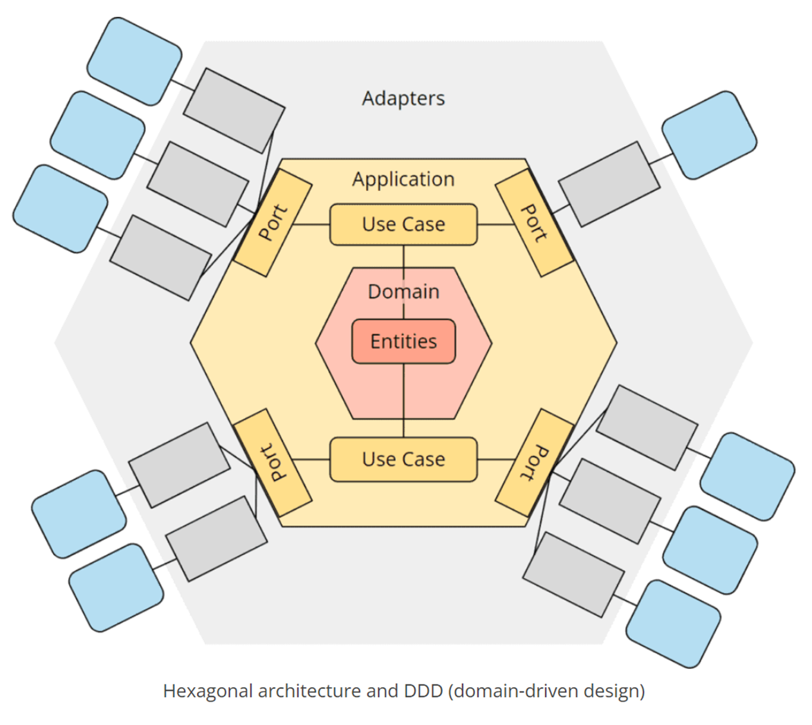
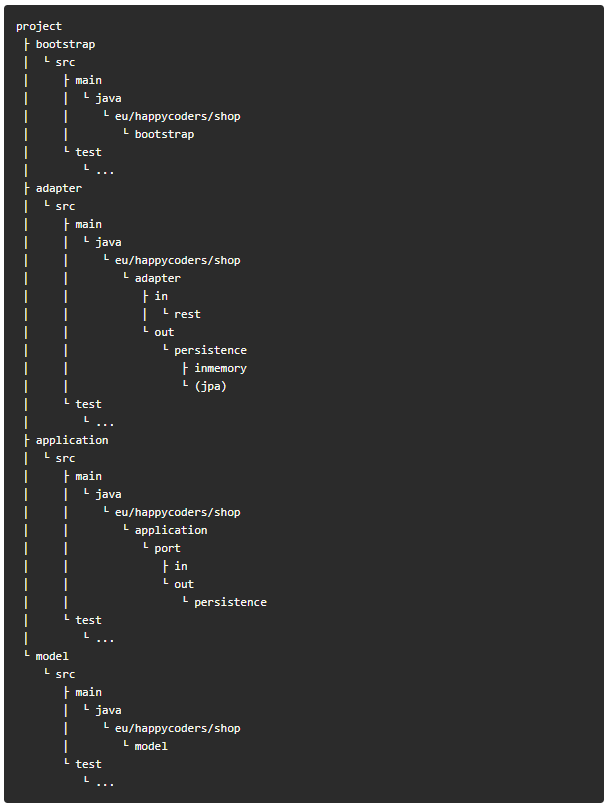

# Hexagonal

```
优秀的软件架构允许在其生命周期内以尽可能少的、持续的努力来进行更改
（并且相应地为客户提供可预测的成本）
```

是否存在这么一种软件架构呢？我们先看一下传统的分层结构


分层结构的业务逻辑直接依赖于数据库，而根据递性依赖表示层也间接依赖与数据库层，
这不仅影响数据库，还影响应用程序访问的任何类型的基础设施层，程序边界模糊。

我们看一下完整的六边形结构：


六边形架构的设计思想源于Alistair Cockburn在2005年提出的“六边形关系图”理论。
```
六边形架构，也被称为端口与适配器架构，是一种用于软件设计的架构模式。
它旨在创建松耦合的应用程序组件，这些组件可以通过端口和适配器与其软件环境轻松连接。
软件系统被视为一个六边形，其中有三组组件构成：
1、核心业务逻辑（Domain）
2、输入和输出端口（Ports）
3、适配器（Adapters）
```

Domain与Ports非常容易理解，我们看下Ports的概念
```
“端口”一词本来的意思指的是电连接，任何符合该连接的机械和电气协议的设备都可以连接到该端口
在这里有点类似语言里面的接口，这样就容易理解了，跟外部的输入输出交互都是通过接口链接。
```

六边形架构的核心思想：
```
1、关注点分离
2、外部可替换
3、依赖倒置
```

接下来看看六边形架构是如何实现上面这些理念的



看一下上图中业务逻辑对数据库的调用是怎么实现依赖倒置的



业务依赖于抽象的接口，接口定义在domain里面，在adapter层实现domain层定义的接口
这样通过依赖倒置的实现把业务与数据层物理隔离。

看一下具体的实现


通常六边形架构与DDD领域驱动设计一起联合使用


最终的代码实现



参考文档：

[https://www.happycoders.eu/software-craftsmanship/hexagonal-architecture/](https://www.happycoders.eu/software-craftsmanship/hexagonal-architecture/)

