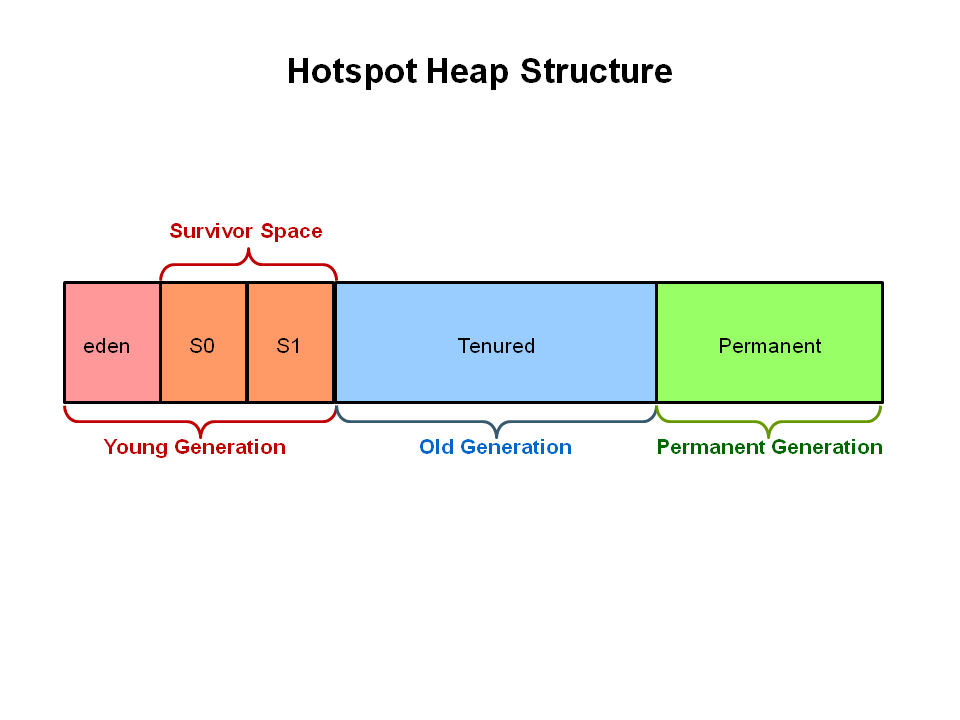

# Jvm深度探索

### JVM 体系结构


JVM有三个重要的组件：Heap、GC、JIT。其中Heap是存储对象数据的位置，Heap区域由启动时选择的垃圾收集器管理，JVM的大多数调优场景就是选择最合适的垃圾收集器和调整堆大小。

### 类加载 ClassLoader

- Bootstrap Class Loader

- Extension Class Loader

- App Class Loader

- User-defined Class Loader

### JVM内存结构


### GC

>自动垃圾收集是查看堆内存，识别正在使用哪些对象以及哪些对象未被删除以及删除未使用对象的过程。
使用中的对象或引用的对象意味着程序的某些部分仍然维护指向该对象的指针。
程序的任何部分都不再引用未使用的对象或未引用的对象。因此可以回收未引用对象使用的内存。
在Java中，解除分配内存的过程由垃圾收集器自动处理。基本过程可以描述如下。
---

1、Marking


2.1、Normal Deletion


2.2 Deletion with Compacting


### 分代GC



Heap结构可以看出堆结构划分：年轻代，老年代，以及永久代

### 分代GC执行过程

1、First, any new objects are allocated to the eden space. Both survivor spaces start out empty.


2、When the eden space fills up, a minor garbage collection is triggered.


3、Referenced objects are moved to the first survivor space. Unreferenced objects are deleted when the eden space is cleared.


4、At the next minor GC, the same thing happens for the eden space. Unreferenced objects are deleted and referenced objects are moved to a survivor space. However, in this case, they are moved to the second survivor space (S1). In addition, objects from the last minor GC on the first survivor space (S0) have their age incremented and get moved to S1. Once all surviving objects have been moved to S1, both S0 and eden are cleared. Notice we now have differently aged object in the survivor space.
  


5、At the next minor GC, the same process repeats. However this time the survivor spaces switch. Referenced objects are moved to S0. Surviving objects are aged. Eden and S1 are cleared.
  


6、This slide demonstrates promotion. After a minor GC, when aged objects reach a certain age threshold (8 in this example) they are promoted from young generation to old generation.


7、As minor GCs continue to occure objects will continue to be promoted to the old generation space.


8、So that pretty much covers the entire process with the young generation. Eventually, a major GC will be performed on the old generation which cleans up and compacts that space.
  


### 各种垃圾收集器的比较

| 名称 | 应用范围 | 算法 | 运行方式 |
| :---- | :---- | :---- | :---- |
| Serial | Young Gen | 复制 | 串行，单线程 |
| ParNew | Young Gen | 复制 | 并行，多线程 |
| Parallel Scavenge | Young Gen | 复制 | 并行，多线程 |
| Serial Old | Old Gen | 标记-整理 | 串行，单线程 |
| Parallel Old | Old Gen | 标记-整理 | 并行，多线程 |
| CMS | Old Gen | 标记-清除 | 并行，多线程 |
| G1 | - | G1 | 并行，多线程 |

### 监控

- jstat -gcutil pid/vmid interval

```
jstat -gcutil 1 1000
```

- jstack -l pid >> file

```
// 进程堆栈打印
jstack -l 17989 >> 123.txt
```

- 虚拟机配置参数 (-verbose:gc是-XX:+PrintGC的别名)

```
-XX:+PrintGCDetails(默认) 
-XX:+PrintGCTimeStamps
-XX:+PrintHeapAtGC 
-XX:+PrintGCDateStamps 
-Xloggc:/path/to/log
```

- jmap -heap pid

```
jmap -heap 790891
```

- jvisualvm

```
jstatd.all.policy // 新建文件
grant codebase "file:/usr/java/default/lib/tools.jar" { // 内容
   permission java.security.AllPermission; 
};
jstatd -J-Djava.security.policy=jstatd.all.policy -J-Djava.rmi.server.hostname=ip // 启动
bin/jconsole.exe // 运行, 远程连接上一步的ip即可进行监控
```

调优-堆参数

| Classification   | Option  |  Description |
| :----  | :----  |  :----  |
| Heap area size  | -Xms， -Xmx | Heap area size when starting JVM， Maximum heap area size |
| New area size  | -XX:NewRatio， -XX:NewSize， -XX:SurvivorRatio | Ratio of New area and Old area， New area size， Ratio of Eden area and Survivor area |

参考文档：

[https://www.oracle.com/webfolder/technetwork/tutorials/obe/java/gc01/index.html](https://www.oracle.com/webfolder/technetwork/tutorials/obe/java/gc01/index.html)
[https://www.cubrid.org/blog/how-to-tune-java-garbage-collection](https://www.cubrid.org/blog/how-to-tune-java-garbage-collection)